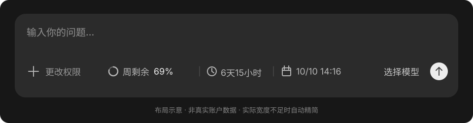

# Codex 额度条 · Windows 增强版

在 Codex 输入框底部查看剩余额度、距离重置的时间和重置日期。



`◔ 周剩余 69%  |  ◷ 6天15小时  |  ▦ 10/10 14:16`

上面是示意数据。实际显示以你自己的 ChatGPT 账户返回结果为准。

这是个人开发的辅助工具，与 OpenAI 无隶属关系。独立运行，不修改 Codex 安装文件。

本仓库基于 [Thinkdiff-lw/codex-quota-bar](https://github.com/Thinkdiff-lw/codex-quota-bar) 修改，保留原项目的 MIT 许可证。当前 Windows 版本为 **1.2.2**；macOS 代码保留上游测试版，以下 Windows 改进不适用于 macOS。

## 当前 Windows 版改进

- 额度条定位在输入框底部的空白区域，窗口移动时即时跟随；中文输入法候选框保持在额度条上方。
- 右键打开独立设置窗口，包含额度概览、外观显示、额度提醒和运行设置；左上角显示 Codex。
- 支持深浅主题、显示详情选择、双额度预览与自动保存；长文字自动换行，小窗口可滚动，检查覆盖 100%～300% 系统缩放。
- 刷新和自动启动设置在后台完成，重复操作有保护，读取失败显示明确状态。
- 额度读取失败保留最近数据并延迟重试；定位超时可恢复，设置损坏时尝试读取备份。
- 提供安装、版本备份与回退脚本，以及窗口层级、设置界面、数据恢复和安装回退测试。

## 下载与开始使用

本仓库的构建产物位于 [GitHub Actions](https://github.com/pykclmz/codex-quota-bar/actions)。选择成功的“Build and release”运行，在 Artifacts 中下载 Windows 构建包并解压，即可得到 `CodexQuotaBar-Windows.zip`。下载 Actions 产物需要登录 GitHub。正式发布后也可从 [Releases](https://github.com/pykclmz/codex-quota-bar/releases) 下载；初次上传尚未发布正式安装包。也可以按下方说明从源码构建。

| 系统 | 下载文件 | 第一次启动 | 详细说明 |
| --- | --- | --- | --- |
| Windows 10 / 11 | `CodexQuotaBar-Windows.zip` | 解压后双击 `启动额度条.cmd` | [Windows 使用说明](docs/windows.md) |
| macOS 13 及以上 | `CodexQuotaBar-macOS.zip` | 将 `.app` 移入“应用程序”后打开 | [Mac 使用说明](docs/macos.md) |

Mac 版是原生 Swift / AppKit 应用，提供 Apple Silicon + Intel 通用二进制。**目前为测试版**：需要辅助功能权限；未经 Apple Developer ID 签名或公证，首次启动可能需要在系统设置中允许打开。通用二进制不代表 Codex 桌面版本身支持所有 Intel Mac，请先确认本机 Codex 能正常运行。

Mac 自动定位受 Codex 的辅助功能控件结构影响。若版本差异导致无法定位，可在菜单栏选择“手动校准位置”。Mac 编译与核心测试由 GitHub Actions 执行；真机输入框定位、多屏、自动登录启动仍需要 Mac 用户验证。

## 自动跟随 Codex

首次开启一次，以后不需要每次手动运行：

- Windows：双击 `开启自动跟随.cmd`，保持工具目录不变。
- Mac：打开菜单栏额度条菜单，勾选“随 macOS 登录启动”；如提示需批准，在系统设置中允许。

实现方式是**系统登录后额度条在后台等待 Codex**。Codex 打开后读取额度并显示，关闭后等待下次打开。切换到其他软件时隐藏，不抢输入焦点。手动退出额度条后，本次登录期间不会自动重新启动；可手动打开，下次系统登录会恢复。

## 显示哪些数据

- 剩余百分比：`100 − 接口返回的已用百分比`。
- 重置倒计时：天 / 小时，或小时 / 分钟；到点后等待接口确认，不自行把额度改成 100%。
- 重置日期：两端统一显示北京时间 `月/日 时:分`。
- 多个额度窗口：显示账户实际返回的窗口，完整详情在悬停提示或托盘 / 菜单栏中查看。
- 空间不足时精简日期、倒计时；没有安全位置时隐藏，避免遮挡操作按钮。
- 数据约每 60 秒刷新；失败后保留上次数据并标记待更新，不显示虚假的满额。

## 登录、数据与隐私

工具通过**本机 Codex CLI 的 app-server** 读取额度。桌面版和 CLI 需要使用同一个账户；首次可能需要在终端运行 `codex login` 完成 CLI 登录。无需提供 API Key；API Key 登录或部分组织账户可能没有此类额度数据。

只调用 `initialize`、`initialized` 和 `account/rateLimits/read`。不发起模型任务，不使用额度重置奖励，也不调用邮件发送等接口。[官方接口说明](https://learn.chatgpt.com/docs/app-server#6-rate-limits-chatgpt)

本工具不读取或保存聊天正文、账户密码和登录令牌。Windows 自动外观会采样周围少量背景像素，不保存截图；Windows 启动日志仅记录启动、退出与异常类型。Mac 辅助功能定位读取控件角色和几何，以及按钮名称；不请求聊天输入框的内容，不需要屏幕录制权限。本工具没有独立的遥测或数据上传；额度请求由本机 Codex CLI 完成。

分享给别人时只分享本仓库或 Releases 安装包。不要附带自己的 `.codex` 目录、`auth.json`、`settings.json`、诊断文件或日志。

## 从源码构建

Windows 在 PowerShell 中运行：

```powershell
cd windows
powershell -NoProfile -ExecutionPolicy Bypass -File .\build.ps1
.\CodexQuotaBar.exe --self-test
```

Windows 使用系统 .NET Framework，不需要 Python 或 Node.js。自检会生成 `test-result.json`，检查结果中的 `passed` 字段。

构建成功后，可运行 `powershell -NoProfile -ExecutionPolicy Bypass -File .\install.ps1` 安装到当前用户的程序目录；更新前自动备份旧版本并保留偏好。右键设置窗口中的“运行设置”可管理随 Windows 登录启动。详细操作与验证方法见 [Windows 使用说明](docs/windows.md) 和 [维护与发布说明](docs/maintainers.md)。

Mac 安装 Xcode Command Line Tools 后，在终端运行：

```bash
cd macos
bash test.sh
bash build.sh
open dist/CodexQuotaBar.app
```

`test.sh` 的 stdio 测试需要 Python 3，发布的应用本身不依赖 Python。构建脚本生成两个架构并合并为通用应用，进行本地 ad-hoc 签名校验。签名不是 Apple Developer ID 公证。

推送 `v*` 标签时，[发布工作流](.github/workflows/release.yml)先测试和构建两端，再上传可下载的压缩包与 SHA256 校验文件。普通代码推送也会运行构建检查。[维护与发布说明](docs/maintainers.md)

## 反馈问题

请在 Issues 说明系统版本、Codex 版本、使用的安装包版本，以及“没有启动 / 已启动但不显示 / 数据错误”中的具体情况。截图请隐藏聊天内容。不要提交令牌或账户配置文件。

MIT License。
